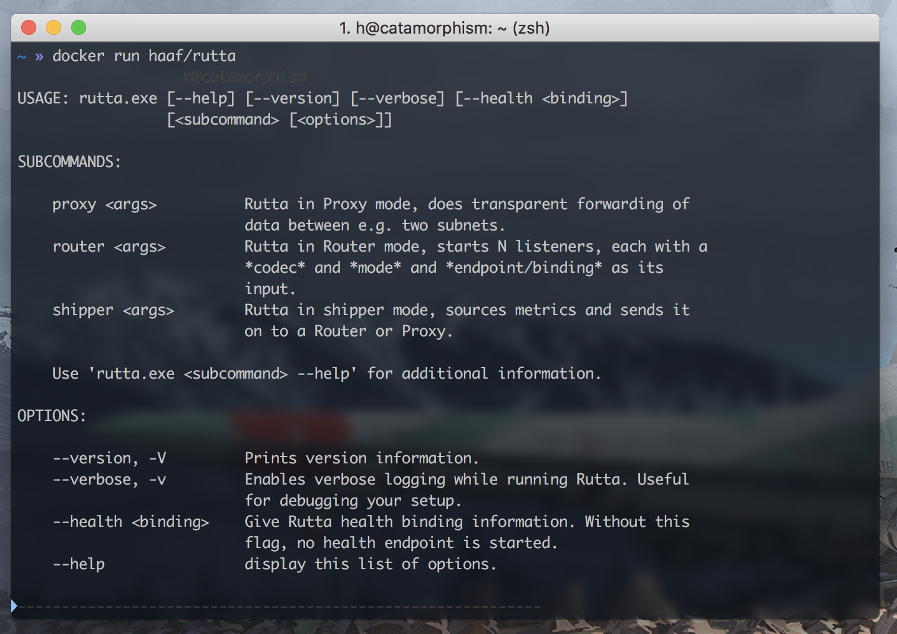
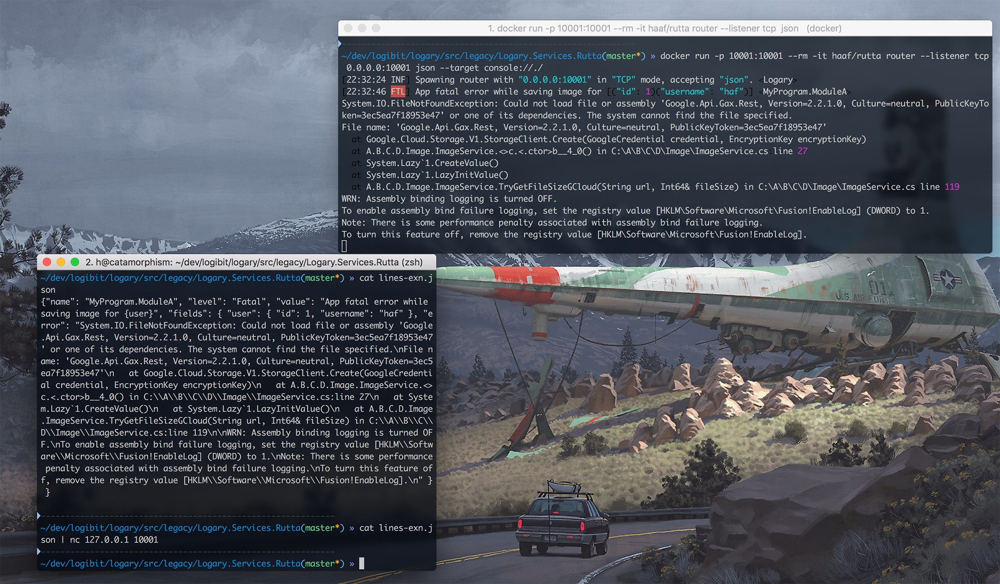
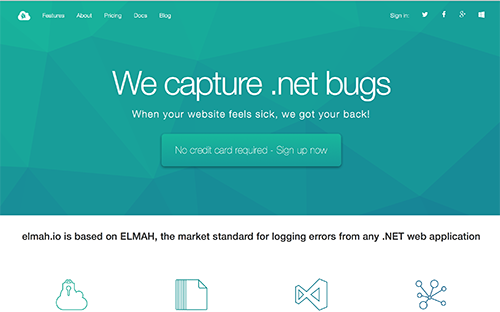
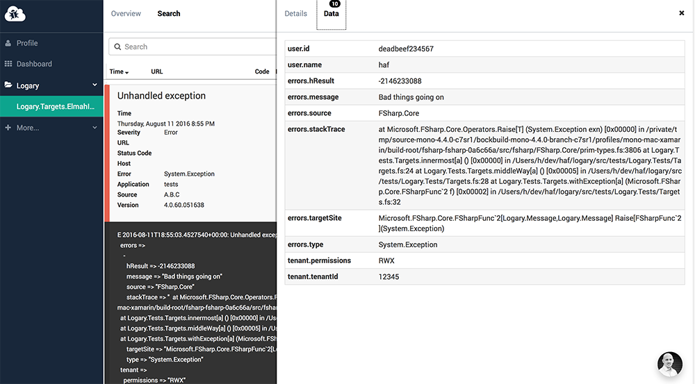

# Logary v5
[](https://travis-ci.org/logary/logary)
[](https://www.nuget.org/packages/Logary)

Follow Logary at twitter: [@logarylib](https://twitter.com/logarylib)

Chat and support and get support:
[](https://gitter.im/logary/logary)

## Why?

Logary is a high-performance, structured logging library which you can do health and metrics for
.Net.

 - Full support for Structured/Semantic Logging
 - F# idiomatic code
 - Using C#? Then `Logary.CSharp` is for you!
 - Looking for an F# alternative to [`LibLog`](https://github.com/damianh/LibLog)?
   Jump to [`Logary.Facade`](#using-logary-in-a-library).
 - Never throws exceptions
 - Low overhead logging – evaluate your Message only if a level is switched on
 - Supports [Hierarchical logging](#rule--hierarchical-logging)
 - Add metrics to your service/app!
 - A wide range of adapters and targets to choose from!

Created by [Henrik Feldt, et al](https://haf.github.io) and sponsored by
[Qvitoo_ – A.I. bookkeeping](https://qvitoo.com/?utm_source=github&utm_campaign=logary).

## Install it

paket.dependencies:

    source https://www.nuget.org/api/v2
    nuget Logary

OR:

    Install-Package Logary


## Table of Contents

<!-- toc -->

- [Hello World (C#)](#hello-world-c)
- [Hello World (F#)](#hello-world-f)
- [Overview](#overview)
- [Tutorial and things around Message](#tutorial-and-things-around-message)
  * [PointName](#pointname)
  * [Context](#context)
    + [Fields](#fields)
    + [Gauges](#gauges)
    + [Exceptions](#exceptions)
    + [Tags](#tags)
    + [SinkTargetNames](#sinktargetnames)
    + [User defined](#user-defined)
  * [Rule & Hierarchical logging & Filter & Minimum level](#rule--hierarchical-logging--filter--minimum-level)
  * [Log Level](#log-level)
  * [Logging from modules](#logging-from-modules)
  * [Logging from a class](#logging-from-a-class)
  * [Logging fields & templating](#logging-fields--templating)
  * [Metrics & EventProcessing pipeline](#metrics--eventprocessing-pipeline)
- [Formatting](#formatting)
- [LiterateConsole logging](#literateconsole-logging)
- [Using logary in a library](#using-logary-in-a-library)
  * [The Logary Facade Adapter](#the-logary-facade-adapter)
  * [How do the `error` and `log` methods differ?](#how-do-the-error-and-log-methods-differ)
  * [Passing more information](#passing-more-information)
  * [A note on the FSI](#a-note-on-the-fsi)
  * [What about API stability?](#what-about-api-stability)
  * [The compiler complains "The type 'Logger' is not compatible with the type](#the-compiler-complains-the-type-logger-is-not-compatible-with-the-type)
  * [More reading](#more-reading)
- [Using in a C# library](#using-in-a-c-library)
  * [More reading](#more-reading-1)
- [InfluxDb Target](#influxdb-target)
- [RabbitMQ Target](#rabbitmq-target)
  * [Usage](#usage)
- [File target (alpha level)](#file-target-alpha-level)
  * [Configuration](#configuration)
  * [Policies & specifications](#policies--specifications)
  * [Performance](#performance)
  * [Handling of errors](#handling-of-errors)
  * [Invariants](#invariants)
  * [Overview of buffers](#overview-of-buffers)
  * [Notes on `FILE_FLAG_NO_BUFFERING`](#notes-on-file_flag_no_buffering)
    + [References](#references)
    + [Example runs](#example-runs)
      - [inProcBuffer = false, flushToDisk = true, caller awaits all acks at the end](#inprocbuffer--false-flushtodisk--true-caller-awaits-all-acks-at-the-end)
      - [inProcBuffer = false, flushToDisk = true, caller awaits all ack after each](#inprocbuffer--false-flushtodisk--true-caller-awaits-all-ack-after-each)
      - [inProcBuffer = true, flushToDisk = false, writeThrough=false caller awaits all acks at the end](#inprocbuffer--true-flushtodisk--false-writethroughfalse-caller-awaits-all-acks-at-the-end)
  * [Work to be done](#work-to-be-done)
- [Stackdriver target](#stackdriver-target)
  * [Configuration](#configuration-1)
  * [Further work](#further-work)
- [AliYun Log Service target](#aliyun-log-service-target)
  * [Usage](#usage-1)
  * [What does it look like?](#what-does-it-look-like)
- [Microsoft Azure Application Insights target](#microsoft-azure-application-insights-target)
- [EventStore adapter](#eventstore-adapter)
- [FsSQL adapter](#fssql-adapter)
- [Suave adapter](#suave-adapter)
- [Topshelf adapter](#topshelf-adapter)
  * [From NLog.RabbitMQ, log4net.RabbitMQ?](#from-nlograbbitmq-log4netrabbitmq)
  * [Logary.Adapters.NLog](#logaryadaptersnlog)
- [Comparison to NLog and log4net](#comparison-to-nlog-and-log4net)
- [Comparison to Codahale metrics & Metrics.NET](#comparison-to-codahale-metrics--metricsnet)
- [Comparison with Serilog](#comparison-with-serilog)
- [Rutta](#rutta)
  * [Usage](#usage-2)
  * [In depth](#in-depth)
  * [The Shipper – from environment to Proxy or Router](#the-shipper-%E2%80%93-from-environment-to-proxy-or-router)
    + [Pushing Shippers](#pushing-shippers)
    + [Publishing Shippers](#publishing-shippers)
  * [The Proxy – from Shipper to Router](#the-proxy-%E2%80%93-from-shipper-to-router)
  * [The Router – from Shipper or Proxy to Target](#the-router-%E2%80%93-from-shipper-or-proxy-to-target)
    + [Pulling Routers](#pulling-routers)
    + [Subscribing Routers](#subscribing-routers)
- [Building](#building)
  * [Building a signed version](#building-a-signed-version)
- [Contributing](#contributing)
  * [File guidelines – module vs static method](#file-guidelines-%E2%80%93-module-vs-static-method)
  * [File guidelines – plural vs singular](#file-guidelines-%E2%80%93-plural-vs-singular)
  * [Namespace guidelines – `Logary.Internals` or not](#namespace-guidelines-%E2%80%93-logaryinternals-or-not)
  * [RuntimeInfo and internal logging](#runtimeinfo-and-internal-logging)
  * [When to write a new function?](#when-to-write-a-new-function)
  * [How to open namespaces?](#how-to-open-namespaces)
  * [To start the job or not?](#to-start-the-job-or-not)
  * [Writing a new target](#writing-a-new-target)
    + [Target guidelines](#target-guidelines)
    + [Publishing your target](#publishing-your-target)
- [Commercial Targets](#commercial-targets)
  * [Mixpanel](#mixpanel)
    + [Features](#features)
    + [What's included?](#whats-included)
  * [OpsGenie](#opsgenie)
    + [Features](#features-1)
  * [elmah.io](#elmahio)
    + [Usage](#usage-3)
    + [What does it look like?](#what-does-it-look-like-1)
  * [SumoLogic (community-contributed)](#sumologic-community-contributed)
  * [Want your SaaS-logging service as a Target?](#want-your-saas-logging-service-as-a-target)
- [FAQ](#faq)
  * [Getting MissingMethodException from FSharp.Core](#getting-missingmethodexception-from-fsharpcore)
  * [Getting MissingMethodException from Hopac.Core](#getting-missingmethodexception-from-hopaccore)
  * [Is v5.0.x a stable version?](#is-v50x-a-stable-version)
  * [Isn't v4.0.x supposed to be API-stable?](#isnt-v40x-supposed-to-be-api-stable)
  * [Why does Logary depend on FParsec?](#why-does-logary-depend-on-fparsec)
  * [Why do you depend on Hopac?](#why-do-you-depend-on-hopac)
  * [How do I use Hopac from C#?](#how-do-i-use-hopac-from-c)
  * [What's `logVerboseWithAck`, `logWithAck` and how does it differ from `logSimple`?](#whats-logverbosewithack-logwithack-and-how-does-it-differ-from-logsimple)
    + [`logWithAck` – so what's up with `Promise`?](#logwithack-%E2%80%93-so-whats-up-with-promise)
    + [How do Promises work with C#?](#how-do-promises-work-with-c)
- [License](#license)

<!-- tocstop -->

## Hello World (C#)

```csharp
using Logary;
using Logary.Configuration;
using Logary.Targets;

// snip

// NuGet: Install-Package Logary
string loggerId = "Logary.MyLogger";
using (var logary = LogaryFactory.New("svc", "host",
    // You could define multiple targets. For HelloWorld, we use only console:
    with => with.InternalLogger(ILogger.NewConsole(LogLevel.Error))
                .Target<TextWriter.Builder>("myFirstTarget",
                   conf => conf.Target.WriteTo(System.Console.Out, System.Console.Error))).Result)
{
    // Then let's log a message. For HelloWorld, we log a string:
    var logger = logary.getLogger(Logary.PointNameModule.Parse(loggerId));
    logger.logSimple(Logary.MessageModule.Event(Logary.LogLevel.Info, "Hello World!"));
    System.Console.ReadLine();
}
```

## Hello World (F#)

```fsharp
open System
open Logary // normal usage
open Logary.Message // normal usage
open Logary.Configuration // conf

let logger = Log.create "Hello World logger"

[<EntryPoint>]
let main argv =
  // normal console app boilerplate;
  use mre = new System.Threading.ManualResetEventSlim(false)
  use sub = Console.CancelKeyPress.Subscribe (fun _ -> mre.Set())

  // create a new Logary; save this instance somewhere "global" to your app/service
  let logary =
    Config.create "Logary.ConsoleApp" "localhost"
    |> Config.target (LiterateConsole.create LiterateConsole.empty "console")
    |> Config.build
    |> Hopac.Hopac.run

  // log something
  logger.info (evenX "{userName} logged in" >> setField "user" "haf")

  mre.Wait()
  0
```

## Overview

Logary is itself a library for metrics and events with extensible inputs, *adapters*, and
outputs, *targets*. Further, its *services* run as their own processes or in
[Suave][suave-site].

 - **Logary** – the main logging and metrics library. Your app depends on this.
 - Logary.CSharp - C# facade that makes it more *object oriented*.
 - Logary.Facade - single file to use in your F# library.
 - **Logary.Targets** (from *Logary* into DBs and monitoring infra):
   * DB – write logs into an arbitrary database: SQL Server, MySQL, PostgreSQL, sqlite and so on...
   * *DB.Migrations* – uses [FluentMigrator](https://github.com/schambers/fluentmigrator/)
     to create and then upgrade your DB between versions of Logary.
   * Heka – ships *Events* and *Metrics* into Heka.
   * InfluxDb – ships *Events* (as annotations) and *Metrics* into [InfluxDb](https://influxdata.com).
   * Logstash – ships *Events* and *Metrics* into [Logstash](https://www.elastic.co/products/logstash)
     [over](https://www.elastic.co/guide/en/logstash/current/plugins-inputs-zeromq.html)
     [ZeroMQ](http://zeromq.org/).
   * <span title="A transactional e-mail service that lets you send e-mail with code">Mailgun</span>
     – ships *Events* over e-mail – send yourself warnings, errors and fatal errors
     via [Mailgun](http://www.mailgun.com/).
   * <span title="The sharpest clojurian knife in the drawer for acting on metrics">Riemann</span>
     – ships *Events* (as a 1-valued gauage) and *Metrics* into [Riemann](http://riemann.io/).
   * Shipper – ships *Messages* (*Events*/*Metrics*) to the `Router` or `Proxy` (see `Rutta` above)
   * ApplicationInsights - ships *Messages* (*Events*/*Metrics*) as trace items to Microsoft Azure Application Insights
 - **Logary.Adapters** (from *X* into Logary):
   * <span title="Make yourself dependent on not just one, but two logging frameworks">CommonLogging</span>
     – *moar abstract* logs into Logary.
   * EventStore – [EventStore](https://geteventstore.com/) logs into Logary.
   * *Facade* –  receiver for `Logary.Facade` logs.
   * <span title="F# API for dealing with DBs">FsSql</span> –
     [FsSql][fssql-nuget] logs into Logary.
   * <span title="A web authorisation library">Hawk</span> - Logibit's
     [Hawk](https://www.nuget.org/packages/Hawk/) logs into Logary.
   * log4net – lets log4net log into Logary.
   * <span title="Suave is a web server library that makes you happy">Suave</span> – ships
     [Suave](https://suave.io) to logs into Logary.
   * <span title="Topshelf is a Windows service host">Topshelf</span> – ships
     [Topshelf](https://www.nuget.org/packages/Topshelf/) logs into Logary.
 - **Logary.Metrics** (from *environment* into Logary):
   * WinPerfCounters – an API to access Windows Performance Counters.
 - **Logary.Services** (stand-alone functionality):
   * Rutta – a godly service of three:
     1. *Ships* Windows Performance Counters to the `Router` or `Proxy`, pushing via a PUB or PUSH ZeroMQ socket.
     2. *Proxies* `Messages` between the `Shipper` and the `Router`, listening on a ZeroMQ XSUB/XPUB socket.
     3. *Routes* `Messages` to Targets, listening on a ZeroMQ SUB or PULL socket.
     <blockquote>
       Note that the shipping feature is its own target as well. Why? So that you can send logs in an efficient,
       high-performance manner between machines, without going through a potentially destructive
       mapping to another serialisation format or through another log router (Heka, Logstash) which
       also may change your data structure.
     </blockquote>
   * SQLServerHealth – a service that keeps track of IO/latency performance for highly loaded SQL Servers
   * Ingestion.Http – a well-maintained Suave WebPart that you run as a part of your Suave
     server, that enables you to use [logary-js](https://www.npmjs.com/package/logary-js).

## Tutorial and things around Message

The core type is **`Message`**, which is the smallest unit you can log.

```fsharp
type Message =
  { /// The 'path' or 'name' of this data point. Do not confuse message template in message.value
    name: PointName
    /// Event (template or raw message) E.g. "{user} logged in"
    value: string
    /// Where in the code? Who did the operation? What tenant did the principal
    /// who did it belong to? ... context can be anything, you can decide how to deal with them in target
    /// through its key.
    context: HashMap<string, obj>
    /// How important? See the docs on the LogLevel type for details.
    level: LogLevel
    /// When? The # of nanoseconds since the UNIX epoch (1970-01-01T00:00:00Z)
    timestamp: EpochNanoSeconds }
```

### PointName

Suppose you're measuring values coming from a car. This is what that could look like:

```fsharp
module Bicycle.SupervisorProcess
open Logary
open Logary.Message

// "the sensor"
let logger = Log.create "Car.SupervisorProcess"

let tyreTick () =
  // "the event is triggered, e.g. via a polling supervisor"
  logger.info (
    eventX "Tyres"
    >> addGauge "front" (Gauge (Float 79.2421, Units.Pascal)))
    >> addGauge "back" (Gauge (Float 90.159, Units.Pascal)))
```

### Context

context are generally classified into these categories: (you can try these code on test.fsx in Logary.Tests)

#### Fields

prefix with "_fields."

Fields are the structured data when you use structure logging like (https://messagetemplates.org/), there are mainly two style to achive this.

```fsharp
type SomeInfo() =
  member x.PropA =
    45
  member x.PropB =
    raise (Exception ("Oh noes, no referential transparency here"))
with
  interface IFormattable with
    member x.ToString (format, provider) = "PropA is 45 and PropB raise exn"

let oneObj = SomeInfo ()

Message.eventFormat (Info, "Hey {userName}, here is a default {info} and stringify {$info} and destructure {@info}", "You", oneObj)
|> Message.setSimpleName "somewhere.this.message.happened"
|> MessageWriter.levelDatetimeMessagePath.format

val it : string =
  "I 2018-01-26T09:08:21.6590074+00:00: Hey "You", here is a default "PropA is 45 and PropB raise exn" and stringify "FSI_0002+SomeInfo" and destructure SomeInfo { PropB: "The property (PropB) accessor threw an (TargetInvocationException): Oh noes, no referential transparency here", PropA: 45 } [somewhere.this.message.happened]
  fields:
    info =>
      SomeInfo {
        PropB => "The property (PropB) accessor threw an (TargetInvocationException): Oh noes, no referential transparency here"
        PropA => 45}
    userName => "You""

// or use this style:

Message.event Info "user write some info"
|> Message.setField "userName" "You"
|> Message.setField "data" oneObj
|> Message.setSimpleName "somewhere.this.message.happened"
|> MessageWriter.levelDatetimeMessagePath.format
```

Results in:

```
val it : string =
  "I 2018-01-26T09:14:08.3286743+00:00: user write some info [somewhere.this.message.happened]
  fields:
    data =>
      SomeInfo {
        PropB => "The property (PropB) accessor threw an (TargetInvocationException): Oh noes, no referential transparency here"
        PropA => 45}
    userName => "You""
```

#### Gauges

prefix with "_logary.gauge."

which value is Gauge(float, units). An instantaneous value. Imagine the needle showing the speed your car is going or a digital display showing the same instantaneous metric value of your car's speed.

you can add gauges with one message, or use gauge as the message. The difference between them is, if you use gauges as the message, the `value` in message are auto generate by gauges when formatting them :

```fsharp
Message.event Info "Processor.% Idle."
|> Message.addGauge "Core 1" (Gauge(0.75, Units.Percent))
|> Message.addGauge "Core 2" (Gauge(0.25, Units.Percent))
|> Message.addGauge "Core 3" (Gauge(0.45, Units.Percent))
|> Message.addGauge "Core 4" (Gauge(0.95, Units.Percent))
|> Message.setSimpleName "somewhere.this.message.happened"
|> MessageWriter.levelDatetimeMessagePathNewLine.format

val it : string =
  "I 2018-01-26T09:24:37.0347486+00:00: Processor.% Idle. Gauges: [Core 1: 75 %, Core 2: 25 %, Core 3: 45 %, Core 4: 95 %] [somewhere.this.message.happened]
  gauges:
    Core 1 => "75 %"
    Core 2 => "25 %"
    Core 3 => "45 %"
    Core 4 => "95 %"
"

or like this :

// will use LogLevel.Debug
Message.event Info "i already do some metric."
|> Message.addGauge "svc1 request per second" (Gauge(1750., Units.Scalar))
|> Message.addGauge "Processor.% Idle.Core 1" (Gauge(0.75, Units.Percent))
|> Message.addGauge "methodA" (Gauge(25000000000., Units.Scaled (Seconds, float Constants.NanosPerSecond)))
|> Message.setSimpleName "somewhere.this.message.happened"
|> MessageWriter.levelDatetimeMessagePathNewLine.format

val it : string =
  "D 2018-01-26T09:25:30.0398251+00:00: Gauges: [Processor.% Idle.Core 1: 75 %, svc1 request per second: 1.75 k, methodA took 25.00 s to execute] [somewhere.this.message.happened]
  gauges:
    Processor.% Idle.Core 1 => "75 %"
    svc1 request per second => "1.75 k"
    methodA => "25 s"
"

```

#### Exceptions

prefix with "_logary.errors"

which value is a list<exn>, when exception are catched, you can just add them to your message like this.

```fsharp
type User =
  {
    id      : int
    name    : string
    created : DateTime
  }

let date20171111 =  DateTime.Parse("2017-11-11")
let foo () = { id = 999; name = "whatever"; created = date20171111}


let ex = exn "exception with data in it"
ex.Data.Add ("data 1 in exn", 1)
ex.Data.Add ("data foo in exn", foo ())
ex.Data.Add (foo(), foo())

Message.event Error "ouch"
|> Message.addExn ex
|> Message.addExn (exn "another exception")
|> Message.setSimpleName "somewhere.this.message.happened"
|> MessageWriter.levelDatetimeMessagePathNewLine.format

val it : string =
  "E 2018-01-26T09:30:37.7648557+00:00: ouch [somewhere.this.message.happened]
  others:
    _logary.errors =>
      -
        System.Exception {
          Message => "another exception"
          HResult => -2146233088}
      -
        System.Exception {
          Message => "exception with data in it"
          Data =>
            "data 1 in exn" => 1
            "data foo in exn" =>
              User {
                name => "whatever"
                id => 999
                created => 11/11/2017 12:00:00 AM}
            - key =>
                User {
                  name => "whatever"
                  id => 999
                  created => 11/11/2017 12:00:00 AM}
              value =>
                User {
                  name => "whatever"
                  id => 999
                  created => 11/11/2017 12:00:00 AM}
          HResult => -2146233088}
"

```

#### Tags

prefix with "_logary.tags"

which value is a set<string> , tags are help with identity one type message when you do some pipeline processing.

```fsharp
>
- let pipeLine =
-    Events.events
-    |> Events.tag "queue"
-    |> Pipe.map (fun msg -> {msg with value = "https://github.com/alexandrnikitin/MPMCQueue.NET"})
-
-
-
- let logm =
-   Config.create "svc" "localhost"
-   |> Config.target (Targets.Console.create Targets.Console.empty "my console target")
-   |> Config.processing pipeLine
-   |> Config.build
-   |> run
-
- let lg = logm.getLogger (PointName.parse "give.some.example.here")
-
- Message.event Info "MPMCQueue"
- |> Message.tag "queue"
- |> Message.tag "high-performance"
- |> Message.tag "lock-free"
- |> Message.tag "multiple-consumers"
- |> lg.logSimple
-
- ;;
I 2018-01-26T09:51:06.0523375+00:00: https://github.com/alexandrnikitin/MPMCQueue.NET [give.some.example.here]
  others:
    _logary.host => "localhost"
    _logary.service => "svc"
    _logary.tags => ["high-performance", "lock-free", "multiple-consumers", "queue"]

```

#### SinkTargetNames

prefix with "_logary.sink.targets"

They are generally are set by Events Processing, you can define which targets (sinks) your message will go. if not set, message will go to all targets and let the targets themself to decide whether or not to accept it.

```fsharp

let pipeLine =
   Events.events
   |> Events.tag "queue"
   |> Pipe.map (fun msg -> {msg with value = "https://github.com/alexandrnikitin/MPMCQueue.NET"})
   |> Events.sink ["nice console"]

let logm =
  Config.create "svc" "localhost"
  |> Config.target (Targets.Console.create Targets.Console.empty "my console target")
  |> Config.target (Targets.LiterateConsole.create Targets.LiterateConsole.empty "nice console")
  |> Config.processing pipeLine
  |> Config.build
  |> run

let lg = logm.getLogger (PointName.parse "give.some.example.here")

Message.event Info "MPMCQueue"
|> Message.tag "queue"
|> Message.tag "high-performance"
|> Message.tag "lock-free"
|> Message.tag "multiple-consumers"
|> lg.logSimple

```


this will only show on LiterateConsole, not normal Console.

#### User defined

things you don't want to show on the message value, but show on the backstore. e.g: some structured data not belong the message template or data you can use in the EventProcessing Pipeline.


```fsharp

Message.eventFormat (Info, "{userId} create an shopping list at {createdTime}", "9999", DateTime.Now )
|> Message.setContext "user name" ":)"
|> Message.setContext "shopping list" ["cat";"cat food";"books";"drinks"]
|> Message.setSimpleName "somewhere.this.message.happened"
|> MessageWriter.levelDatetimeMessagePath.format

val it : string =
  "I 2018-01-26T10:11:54.5221326+00:00: "9999" create an shopping list at 1/26/2018 6:11:54 PM [somewhere.this.message.happened]
  fields:
    userId => "9999"
    createdTime => 1/26/2018 6:11:54 PM
  others:
    user name => ":)"
    shopping list => ["cat", "cat food", "books", "drinks"]"

```


### Rule & Hierarchical logging & Filter & Minimum level

A logger have a minimum level which message's level below it is not processed when logging these message. Can give us Low overhead logging – evaluate your Message only if a level is switched on. Especially when you use logging api with message factory.

A logger's minimum level are config through `Config.loggerMinLevel "a.b.*" LogLevel.Fatal` on logary conf (usually globally) use a specific name or some hierarchy path. And can be switch on fly `logm.switchLoggerLevel ("a.b.*", LogLevel.Info)`,this will only affect the loggers (its name, not its instance) which have been created beafore. e.g. the default level is Error on prod, use a pipe line detect an error message, switch to Info for 5 mins then change it back. can be use for auto collecting more useful info when things goes wrong.

```fsharp

let logm =
  Config.create "svc" "localhost"
  |> Config.target (Targets.LiterateConsole.create Targets.LiterateConsole.empty "nice console")
  |> Config.loggerMinLevel "a.b.*" LogLevel.Fatal
  |> Config.build
  |> run

let ab = logm.getLogger (PointName.parse "a.bxxxx")

ab.info (Message.eventX "ab.info" >> (fun msg -> printfn "invoke %s" msg.value; msg)) // no invoke
logm.switchLoggerLevel ("a.b.*", LogLevel.Info)
ab.info (Message.eventX "ab.info" >> (fun msg -> printfn "invoke %s" msg.value; msg)) // hurry


> ab.info (Message.eventX "ab.info" >> (fun msg -> printfn "invoke %s" msg.value; msg)) // no invoke
- ;;
val it : unit = ()

> logm.switchLoggerLevel ("a.b.*", LogLevel.Info)
- ;;
val it : unit = ()

> ab.info (Message.eventX "ab.info" >> (fun msg -> printfn "invoke %s" msg.value; msg)) // hurry
- ;;
invoke ab.info
val it : unit = ()

> [19:22:25 INF] ab.info <a.bxxxx>
  others:
    _logary.host => "localhost"
    _logary.service => "svc"

```


A target can have multiple rules (minlevel, path, filter), **specific rule should comes last, be careful with the add order**, A rule specifies what messages a target should accept. we do not encourage use rules heavily,only if when the target itself can decide which msg are acceptable. usually this decision is made by EventProcessing pipeline, can be done with code rather than the rules.

Message log level are set when use logging api.

```fsharp

let someRuleOnTarget =
  Rule.empty
  |> Rule.setMinLevel LogLevel.Error // this target will only get message about error level (inclusive)
  |> Rule.setPath (System.Text.RegularExpressions.Regex("a.b.c.*")) // only accept message name under a.b.cxxxxx
  |> Rule.setAcceptIf (fun msg -> msg |> Message.hasTag "emergency")

let tconf =
  Targets.LiterateConsole.create Targets.LiterateConsole.empty "nice console"
  |> TargetConf.addRule someRuleOnTarget
let logm =
  Config.create "svc" "localhost"
  |> Config.target tconf
  |> Config.loggerMinLevel "a.b.*" LogLevel.Fatal  // logger under a.bxxxx path only process Fatal message
  |> Config.loggerMinLevel "a.b.c.*" LogLevel.Info // logger under a.b.cxxxx path can process message above Info
  |> Config.build
  |> run

let abc = logm.getLogger (PointName.parse "a.b.cxxx")
let ab = logm.getLogger (PointName.parse "a.bxxx")

abc.verbose (Message.eventX "abc.Info" >> fun msg -> printfn "invoke %s" msg.value; msg) // no invoke
abc.error (Message.eventX "abc.Error" >> fun msg -> printfn "invoke %s" msg.value; msg) // invoke, but will not go to target
abc.error (Message.eventX "abc.Error with emergency tag" >> (fun msg -> printfn "invoke%s" msg.value; msg) >> Message.tag "emergency") // hurray

ab.error (Message.eventX "ab.Error" >> (fun msg -> printfn "invoke %s" msg.value; msg) >> Message.tag "emergency") // no invoke
ab.fatal (Message.eventX "ab.Fatal" >> (fun msg -> printfn "invoke %s" msg.value; msg) >> Message.tag "emergency") // hurray

> abc.verbose (Message.eventX "abc.Info" >> fun msg -> printfn "invoke %s" msg.value; msg) // no invoke
- ;;
val it : unit = ()

> abc.error (Message.eventX "abc.Error" >> fun msg -> printfn "invoke %s" msg.value; msg) // invoke, but will not go to target
- ;;
invoke abc.Error
val it : unit = ()

> abc.error (Message.eventX "abc.Error with emergency tag" >> (fun msg -> printfn "invoke%s" msg.value; msg) >> Message.tag "emergency") // hurray
- ;;
invokeabc.Error with emergency tag
val it : unit = ()

> [19:06:33 ERR] abc.Error with emergency tag <a.b.cxxx>
  others:
    _logary.host => "localhost"
    _logary.service => "svc"
    _logary.tags => ["emergency"]

> ab.error (Message.eventX "ab.Error" >> (fun msg -> printfn "invoke %s" msg.value; msg) >> Message.tag "emergency") // no invoke
- ;;
val it : unit = ()

> ab.fatal (Message.eventX "ab.Fatal" >> (fun msg -> printfn "invoke %s" msg.value; msg) >> Message.tag "emergency") // hurray
- ;;
invoke ab.Fatal
[val19:07:45  FTLit]  ab.Fatal:  unit<a.bxxx>
  others:
    _logary.host => "localhost"
    =_logary.service => "svc"
    _logary.tags  => ["emergency"]


```

### Log Level

The highest log level is `Fatal`, which should be reserved for things that make
your service/process crash. Things like; "my disk is full and I'm a database
trying to start", or "I'm a 2-tier service built with a database, that I cannot
do any work without" warrant the `Fatal` level.

At this level human beings are normally directly alerted.

The next level is `Error`, which should be reserved for what you consider to be
edge-cases. E.g. if the data received from a socket is corrupt, or there was an
unhandled exception that you as a programmer did not have in your mental model
while writing the code. These events should be logged at the `Error` level.

At this level human beings are normally directly alerted.

`Warn` is for things like 100 failed password attempts within 5 minutes, for
one of your users, or a temporary network glitch while communicating with a
"resource" such as your database.

If these events for an anomaly persist over time, humans may be alerted.

At `Info` level, I like to put events and gauges that measure company-relevant
stuff, like when users sign in, sign up, an integration has to perform a retry
or a service was started/restarted.

`Debug` level is the default level and the work-horse. You normally log all
metrics at this level.

`Verbose` is the level when you want that little extra. Not normally enabled.

### Logging from modules

Let's say you have a module in your F# code that you want to log from. You
can either get a logger like shown in *Hello World*, or you can do something
like this:

``` fsharp
module MyCompany.Sub.MyModule

open Logary

let logger = Logging.getCurrentLogger ()

let logInUser () =
  // do something
  Message.event Info "User logged in" |> Logger.logSimple logger
  // do more stuff
```

If you want to name your logger with a specific name, you can use
`Logging.getLoggerByName` instead. (This is different for the Facade file)

### Logging from a class

Similarly, sometimes you want to log from a class, and perhaps log some metrics too.

```fsharp
namespace MyCompany.Sub

open Logary

type Worker() =
  let logger =
    Logging.getLoggerByName "MyCompany.Sub.Worker"

  let workName =
    PointName [| "MyCompany"; "Sub"; "Worker"; "workDone" |]

  let getAnswers (amount : float) =
    // work work work
    42 * amount

  member x.Work (amount : float) =
    // Initially, log how much work is to be done
    // the only "supported" metric is a gauge (a value at an instant)
    Message.gauge workName amount |> Logger.logSimple logger

    // do some work, logging how long it takes:
    let everything = Logger.time logger (fun () -> getAnswers amount)

    // return result
    everything
```

In this example you learnt how to send arbitrary metrics to Logary (the gauge)
and also how to time how long certain method calls take in your system.

Make it a habit to log these sort of gauges all over your code base while
you write your code, to make it much easier to understand the system as it
develops.

In fact, the more you do this, the more use you will have of Logary and of
the dashboard you put up in Kibana (via Logstash) or Grafana (via InfluxDb).
Put it up on a big TV in your office and you'll develop a second sense of
whether the system is doing well or not, just from looking at the graphs.

### Logging fields & templating

The templates syntax can be found here:  https://messagetemplates.org/#syntax

Message Templates are a superset of standard .NET format strings, so any format
string acceptable to string.Format() will also be correctly processed by logary.

 * Property names are written between `{` and `}` braces
 * Braces can be escaped by doubling them, e.g. `{{` will be rendered as `{`
 * Formats that use numeric property names, like `{0}` and `{1}` exclusively, will
   be matched with the `Format` method's parameters by treating the property names
   as indexes; this is identical to `string.Format()`'s behaviour
 * If any of the property names are non-numeric, then all property names will be
   matched from left-to-right with the `Format` method's parameters
 * Property names may be prefixed with an optional operator, `@` or `$`, to control
   how the property is serialised
 * Property names may be suffixed with an optional format, e.g. `:000`, to control
   how the property is rendered; these format strings behave exactly as their
   counterparts within the `string.Format()` syntax

### Metrics & EventProcessing pipeline

Sometimes you need a metric that runs continuously over time. A `Ticker` can be seems
as a metric, it can be auto triggered or by manually. A ticker can be chained
in an pipe line (EventProcessing).

We have some windows performance counter metrics that you can use.

But you sometimes want to chain metrics from events or gauges happening inside your own application.

This sample demonstrates how to chain metric from other simpler ones.
And we generates an exponentially weighted moving average from randomWalk gauges.

```fsharp
module Program

open System
open System.Threading
open Hopac
open Logary
open Logary.Configuration
open NodaTime
open Logary.Targets
open Logary.Metrics.WinPerfCounters
open Logary.EventProcessing

module Sample =

  let randomWalk pn =
    let reducer state = function
      | _ ->
        state

    let ticker (rnd : Random, prevValue) =
      let value =
        let v = (rnd.NextDouble() - 0.5) * 0.3
        if abs v < 0.03 then rnd.NextDouble() - 0.5
        elif v + prevValue < -1. || v + prevValue > 1. then -v + prevValue
        else v + prevValue

      let msg = Message.gauge pn value

      (rnd, value), msg

    let state =
      let rnd = Random()
      rnd, rnd.NextDouble()

    Ticker.create state reducer ticker

[<EntryPoint>]
let main argv =
  let inline ms v = Duration.FromMilliseconds (int64 v)
  let pn name = PointName [| "Logary"; "Samples"; name |]
  use mre = new ManualResetEventSlim(false)
  use sub = Console.CancelKeyPress.Subscribe (fun _ -> mre.Set())
  let clock = SystemClock.Instance
  let tenSecondsEWMATicker = EWMATicker (Duration.FromSeconds 1L, Duration.FromSeconds 10L, clock)
  let randomWalk = Sample.randomWalk "randomWalk"
  let walkPipe =  Events.events |> Pipe.tickTimer randomWalk (TimeSpan.FromMilliseconds 500.)
  let systemMetrics = Events.events |> Pipe.tickTimer (systemMetrics (PointName.parse "sys")) (TimeSpan.FromSeconds 10.)
  let processing =
    Events.compose [
       walkPipe
       |> Events.sink ["WalkFile";]

       walkPipe
       |> Pipe.choose (Message.tryGetGauge "randomWalk")
       |> Pipe.counter (fun _ -> 1L) (TimeSpan.FromSeconds 2.)
       |> Pipe.map (fun counted -> Message.eventFormat (Info, "There are {totalNumbers} randomWalk within 2s", [|counted|]))
       |> Events.sink ["Console";]

       walkPipe
       |> Pipe.choose (Message.tryGetGauge "randomWalk")
       |> Pipe.map (fun _ -> 1L) // think of randomWalk as an event, mapping to 1
       |> Pipe.tickTimer tenSecondsEWMATicker (TimeSpan.FromSeconds 5.)
       |> Pipe.map (fun rate -> Message.eventFormat (Info, "tenSecondsEWMA of randomWalk's rate is {rateInSec}", [|rate|]))
       |> Events.sink ["Console";]

       systemMetrics
       |> Pipe.map Array.toSeq
       |> Events.flattenToProcessing
       |> Events.sink ["LiterateConsole"; "WPCMetricFile";]
    ]

  let console = Console.create Console.empty "Console"
  let literalConsole = LiterateConsole.create LiterateConsole.empty "LiterateConsole"
  let randomWalkFileName = File.Naming ("{service}-RandomWalk-{date}", "log")
  let wpcFileName = File.Naming ("{service}-wpc-{date}", "log")
  let randomWalkTarget = File.create (File.FileConf.create Environment.CurrentDirectory randomWalkFileName) "WalkFile"
  let wpcFileTarget = File.create (File.FileConf.create Environment.CurrentDirectory wpcFileName) "WPCMetricFile"
  let logary =
    Config.create "Logary.Examples.MetricsWriter" "localhost"
    |> Config.targets [console; literalConsole; randomWalkTarget; wpcFileTarget;]
    |> Config.ilogger (ILogger.Console Verbose)
    |> Config.processing processing
    |> Config.build
    |> run

  mre.Wait()
  0
```

By wrapping it up like this, you can drastically reduce the amount of code
a given service sends by pre-computing much of it.

It's also a good sample of reservoir usage; a fancy name of saying that
it's an algorithm that works on more than one gauge at a time, to produce
a derived metric.

## Formatting

TO BE DONE. The sketchy cen be seen here in comments : https://github.com/logary/logary/issues/275

## LiterateConsole logging

Console logging is only meant for human consumption; don't rely on it for
logging in your actual services. As such, Logary is able to do improvements
to its console target, so that it's as good as possible for human
consumption.

Generally, we have `Message -> Colouriser -> Writer`. Here the `Message` is
what is fed from callers and metrics into the target. The colouriser has a
signature alike `Message -> (string * Colour) list`, which maps some projection
of the message into the domain of strings and their corresponding colours; i.e.
actual colourised lines of output.

It's the `Writer` that takes the string-colour pairs and display those on the
terminal like so `(string * Colour) list -> unit`.

The console target supports different themes. A theme is a subsystem of the
colouriser that takes a `Token -> Colour`. Different themes makes for different
moods.

## Using logary in a library

The above guide serves to explain how you use Logary in a service or
application, but what if you have a library and don't want to take a dependency
on a specific logging framework, or logging abstraction/indirection library?

For this use-case, Logary provides F# facades that you can easily reference using Paket.
I've created a [sample library](https://github.com/logary/logary/tree/master/examples/Libryy) for you
to have a look at. Note how `paket.references` specifies `Facade.fs` as a file
dependency. The corresponding `paket.dependencies` contains the entry below.

```
github logary/logary src/Logary.Facade/Facade.fs
```

If you don't want to add a github reference, you can also choose to copy-n-paste
the file into your project. As long as you don't change the public API surface
area, you'll be fine (i.e. don't make breaking changes).

In my Rakefile I have a small replacement script that sets the library's
namespace inside the referenced `Facade.fs` file.

```bash
ruby -pi.bak -e \
  "gsub(/namespace Logary.Facade/, 'namespace Libryy.Logging')" \
  paket-files/logary/logary/src/Logary.Facade/Facade.fs
```

Or in FAKE 4 style:

```fsharp
Target "LoggingFile" (fun _ ->
    ReplaceInFiles [ "namespace Logary.Facade", "namespace MyLib.Logging" ]
                   [ "paket-files/logary/logary/src/Logary.Facade/Facade.fs" ]
)
```

Or in FAKE 5 style:

```fsharp
#r "paket: groupref Build //"
#load ".fake/build.fsx/intellisense.fsx"
open Fake.IO
Target.create "Replace" <| fun _ ->
  Shell.ReplaceInFiles
    [ "Logary.Facade", "MyLib.Logging" ]
    (!! "paket-files/logary/logary/src/Logary.Facade/Facade.fs")
```

Now add to `paket.references` (replace `Logging` with a folder name of your choice,
or remove to have Paket not place the (single) file in a folder within the project):

```
File: Facade.fs Logging
```

Inside the library you use the logger just like you'd expect:

``` fsharp
module Libryy.Core

// Note: this library has no reference to Logary proper!
open Libryy.Logging
open Libryy.Logging.Message

let work (logger : Logger) =
  logger.warn (
    eventX "Hey {user}!"
    >> setField "user" "haf"
    >> setSingleName "Libryy.Core.work"
    >> setTimestamp 1470047883029045000L)

  42

let simpleWork (logger : Logger) =
  logger.logSimple (Message.event Error "Too simplistic")
  43
```

Or statically:

```fsharp
module Libryy.Core

open Libryy.Logging
open Libryy.Logging.Message

let internal logger = Log.create "Libryy.Core"

let work () =
  logger.info (eventX "Started work")
  48
```

Any service/application that uses `Libryy` *does* reference the `Logary` and `Facade` nugets, e.g.:

```
source https://www.nuget.org/api/v2
nuget Logary
nuget Logary.Adapters.Facade
```

### The Logary Facade Adapter

The calling service/application then creates a new `Logger` specifically for the
library that it aims to ship/extract logs from.

```fsharp
// opens ...
open Logary.Adapters.Facade

let logary =
  Config.create "Servizz.Program" "localhost"
  |> Config.targets [ LiterateConsole.create LiterateConsole.empty "console" ]
  |> Config.processing (Events.events |> Events.sink ["console";])
  |> Config.build
  |> run

// Initialise Libryy so it logs to Logary (proper)
LogaryFacadeAdapter.initialise<Libryy.Logging.Logger> logary

// if you need a Logger instance:
let logger = logary.getLogger (PointName [| "Libryy" |])
let res = Libryy.Core.work (LoggerAdapter.createGeneric logger)
```

Outputs:

```
W 2016-08-01T10:38:03.0290450+00:00: Hey haf! [Libryy.Core.work]
  user => "haf"
```

By default, the Facade has a global console logger that logs at `Info` level.

The reason for this is that people normally expect output to come in the
'just installed' case, without hunting for `\*.Logging.Global.initialise` first.

### How do the `error` and `log` methods differ?

If you look inside `Facade.fs` you'll find that `LoggerEx` has `error`, `info`,
etc... as extension methods on the `Logger` interface and that these are marked
internal to the library you're working inside.

`error`, `info` and so on are actually message factories that take a `LogLevel`
and return a `Message`. By using them like this `logger.error (eventX "templ")`,
you're only evaluating the constructor for `Message` if and only if the level of
your logger is greater or equal to `error`.

If we were to expand the point-free style (eta-expansion), it would look like
this: `logger.error (fun level -> Message.eventX "templ" level)`, i.e. what you
pass to the `error` extension method is a factory function, and the `Message`
module provides `gauge`, `event` and `eventX` to create the different kinds of
messages.

### Passing more information

Using the event-templates, you can pass more information to be logged:

```fsharp
with ex ->
  logger.error (
    eventX "Unhandled exception for {user}"
    >> setField "user" user.name
    >> addExn ex)
```

Note the placeholder `{user}` for the user's name in the event template. By
default these will be printed to the console, and if you use
`Logary.Adapters.Facade` you may use all the templating features of
[MessageTemplates](https://github.com/messagetemplates/) for plain-text targets.

### A note on the FSI

`Logary.Adapters.Facade`, the adapter for the library Facade, works by
generating a dynamic interface implementation at runtime. It doesn't work very
well if your library is being used from the F# interactive and all the
library's code, including the `Logger` interface is only available in the
interactive state. You'll end up with a `StackOverflowException` if you try
this.

However, the beauty is that when you're in the interactive, you can just let
the library handle logging through the default Facade targets; i.e. you don't
have to initialise Logary proper to use and read logs in the console, from the
Facade.

### What about API stability?

The F# facade has gone through two versions; have a look at how versioning is
managed by browsing the unit tests. The Facade aims to be 100% stable, even
across major versions of Logary. The adaptation is done in
`Logary.Adapters.Facade`, which can afford to take some amount of complexity to
keep the Facade itself clean. It's also here you should look if you want to
optimise the translation of Facade types into Logary types.

### <q>The compiler complains "The type 'Logger' is not compatible with the type
'Logging.Logger'"</q>

You're trying to assign some other Logger interface implementation to the
target. The line `LoggerAdapter.createGeneric<'loggerType> logger` from above is
what you can use to create a logger of the correct type.

It will generate a new instance of the library's logger type, as long as that
logger type correctly implements the Facade.fs interface.

### More reading

 - [Facade.fs](https://github.com/logary/logary/blob/master/src/Logary.Facade/Facade.fs)
   – the actual file that gets imported into your library.
 - [Facade unit tests](https://github.com/logary/logary/blob/master/src/tests/Logary.Facade.Tests/Facade.fs)
   – the unit tests for the facade file.
 - [Facade Adapter](https://github.com/logary/logary/blob/master/src/adapters/Logary.Adapters.Facade/Logary.Adapters.Facade.fs)
   – the facade adapter (advanced code)
 - [Facade Adapter unit tests](https://github.com/logary/logary/blob/master/src/tests/Logary.Adapters.Facade.Tests/Program.fs)
   – the unit tests for the adapter, which are also good documentation on how to
   use it.

## Using in a C# library

In your lib:

```
github logary/logary src/Logary.CSharp.Facade/Facade.cs
```

This file will be updated when you do 'paket restore', so if you make changes
to this file, remember to put them back in (e.g. via `git checkout --`) when
you're done with the `restore` or `update`.

In your composition root:

```
source https://www.nuget.org/api/v2
nuget Logary
nuget Logary.Adapters.Facade
```

Have a look at `examples/Cibryy` for an example of usage of the C# facade.

### More reading

 - [Facade.cs](https://github.com/logary/logary/blob/master/src/Logary.CSharp.Facade/Facade.cs)
   – the actual file that gets imported into your library.
 - [The Logary Facade Adapter](#the-logary-facade-adapter)


## InfluxDb Target

 - Events will be logged to InfluxDb like such:
   `"{pointName},event={template},ctx1=ctxval1,ctx2=ctxval2 field1=fieldval1,field2=fieldval2 value=1i 14566666xxxx"`
 - In other words, fields will be influx values and context fields will be influx tags.
 - The timestamp of the Message will be at the end as the timestamp of the sent line
 - Events will be logged in these influx measure names, so that you could e.g. put `"event_fatal"` as
   an annotation in Grafana:
   * `event_verbose`
   * `event_debug`
   * `event_info`
   * `event_warn`
   * `event_error`
   * `event_fatal`

## RabbitMQ Target

I've written a full RabbitMQ target that includes publisher confirms and durable
messaging. It's fully usable from C# too (since C#-ists like RMQ), through the
[builder
API](https://github.com/logary/logary/blob/master/src/targets/Logary.Targets.RabbitMQ/Targets_RabbitMQ.fs#L359).

Docs are [in this
code](https://github.com/logary/logary/blob/master/src/targets/Logary.Targets.RabbitMQ/Targets_RabbitMQ.fs#L29)
– and you'll find the code fairly readable.

### Usage

```fsharp

  let rmqConf =
    { RabbitMQ.empty with
        appId = Some "Logary.ConsoleApp"
        username = "appuser-12345"
        password = "TopSecret1234"
        tls = { RabbitMQ.TlsConf.certPath = "./certs/mycert.pfx"
                RabbitMQ.TlsConf.certPassword = Some "AnotherSecret1243567" }
              |> Some
        compression = RabbitMQ.Compression.GZip
    }

```

Then inside `withTargets`:

```fsharp
RabbitMQ.create rmqConf "rabbitmq"
```


## File target (alpha level)

Logary's file target is primarily geared towards systems that are running on
single machines as it prints a human-readable format, rather than a machine-
readable one.

### Configuration

The default configuration of the file target rotates log files greater than 200
MiB and deletes log files when the configured folder size is larger than 3 GiB.

Folders that don't exist when the target starts are automatically created on
target start-up in the current service's security context. Should the calls to
create the folder fail, the target is never started, but will restart
continuously like any ther Logary target.

```fsharp
let fileConf =
  { File.FileConf.create logDir (Naming ("{service}-{host}-{datetime}", "log")) }

// ... withTargets [
  File.create fileConf "file"
// ] ...
```

Or in C#:

```csharp
// set 'logDir' to specific path like Environment.CurrentDirectory if you are on windows
.Target<File.Builder>(
    "file",
    file => file.Target.FileSystem(new FileSystem.DotNetFileSystem(logDir))
                       .Naming("{service}-{host}-{datetime}", "log").Done())
```

### Policies & specifications

You can specify a number of **deletion** and **rotation** policies when
configuring the file target. The deletion policies dictate when the oldest logs
should be deleted, whilst the rotation policies dictates when the files should
be rotated (thereby the previous file archived).

Furthermore, you can specify a **naming** specification that dictates how the
files sould be named on disk.

 - Deletion of files happen directly when at least one deletion policy has
   triggered.
 - Rotation of files happen directly when at least one rotation policy has
   triggered.
 - Naming specifications should automatically be amended with sequence number,
   should that be required.

### Performance

The `File` target is a performance-optimised target. Logging always happens on
a separate thread from the caller, so we try to reach a balance between
throughput and latency on ACKs.

On Windows, overlapped IO is *not* used, because the files are opened in Append
mode, should have equivalent performance. This means we should have similar
performance on Linux and Windows.

The formatters used for the `File` target should be writing to `TextWriter`
instances to avoid creating extra string copies in memory.

### Handling of errors

The file target is thought as a last-chance target, because by default, logs
should be shipped from your nodes/machines to a central logging service. It
can also be nicely put to use for local console apps that need to log to disk.

 - Non-target-fatal `IOException`s, for example when NTFS ACKs file deletes but
   still keeps the file listable and available for some duration afterwards are
   retried on a case-by-case basis. Internal Warn-level messages are logged.
 - Fatal `IOException`s – more other cases; directory not found, file not found,
   etc. are not retried. The target should crash and restart. Its current batch
   is then retried forever, while logging internal Fatal-level exceptions.

### Invariants

 - The `File` target is modelled as a transaction log and trades speed against
   safety that the contents have been written to disk, but does not do the
   bookkeeping required to use `FILE_FLAG_NO_BUFFER`.
 - `Fatal` level events are automatically flushed/fsync-ed.
 - Only a single writer to a file is allowed at any given time. This
   invariant exists because atomic flushes to files are only possible on Linux
   up to the page size used in the page cache.
 - Only asynchronous IO is done, i.e. the Logary worker thread is not blocked
   by calls into the operating system. Because of the overhead of translating
   callbacks into Job/Alt structures, we try to write as much data as possible
   on every call into the operating system. This means that Messages to be
   logged can be ACKed in batches rather than individually.
 - If your disk collapses while writing log messages (which happens once in a
   while and happens frequently when you have thousands of servers), the target
   should save its last will and then retry a configurable number of times after
   waiting an exponentially growing duration between each try. It does this by
   crashing and letting the supervisor handle the failure. After exhausting the
   tries, the batch of log messages is discarded.
 - If there are IO errors on writing the log messages to disk, there's no
   guarantee that there won't be duplicate log lines written; however, they're
   normally timestamped, so downstream log ingestion systems can do
   de-duplication. This is from the batched nature of the File target.

### Overview of buffers

 1. You write a `Message` from your call-site, this message is synchronised
    upon between the sending thread and the receiving thread using Hopac.

   i. If you use one of the `logWithAck` functions, placing the message in the
      `RingBuffer` can be awaited (or `NACK`ed)

   ii. If you use the `logSimple` function, the synchronisation is hoisted onto
      the concurrency scheduler's pending queue and raced with a timeout to be
      discarded if the logging subsystem is overwhelmed.

 2. Once the `Message` is in the `RingBuffer` of the `File` target, it's either
    removed by itself, or as part of a batch, to be serialised to string.

 3. The serialisation function reads through the values of the message and
    uses the formatter function to write those values into a `TextWriter`. The
    `TextWriter` is normally a `StreamWriter` writing to a `FileStream`. This
    means no extra strings need be created through concatenation.

 4. Depending on the `inProcBuffer` configuration flag, the `TextWriter` either
    supports buffering, which buffers the string inside the CLR process, or
    writes directly to the underlying *file handle*, which transitions the
    data to the kernel's ioctl subsystem. By default we don't buffer here.

 5. Depending on the `flushToDisk` configuration flag, the `FileStream` is or
    is not called with `Flush(true)`, which forces a disk synchronisation. By
    default we let the page cache buffer these writes, to trade safety against
    throughput. This is similar to how most other targets work.

    Depending on the `writeThrough` flag; `Message`s written with the `File`
    target is only ACKed when they are durably on disk. Defaults to true.

Note that disposing Logary, e.g. during application exit flushes all buffers.

### Notes on `FILE_FLAG_NO_BUFFERING`

I've been considering supporting
[NO\_BUFFERING](https://msdn.microsoft.com/en-us/library/windows/desktop/cc644950(v=vs.85).aspx)
but this would require callers to possibly wait for the 4096 bytes buffer to
fill up before ACKing messages. However, for low-throughput logging, where each
log line may be around, say, 240 bytes of text, having the `NO_BUFFERING` flag
set may end up losing us more than it gains us.

#### References

 - https://support.microsoft.com/en-us/kb/99794
 - https://stackoverflow.com/questions/317801/win32-write-to-file-without-buffering
 - https://winntfs.com/2012/11/29/windows-write-caching-part-2-an-overview-for-application-developers/
 - https://msdn.microsoft.com/en-us/library/windows/desktop/cc644950(v=vs.85).aspx
 - https://msdn.microsoft.com/en-us/library/windows/desktop/aa363772(v=vs.85).aspx
 - https://stackoverflow.com/questions/8692635/how-do-disable-disk-cache-in-c-sharp-invoke-win32-createfile-api-with-file-flag
 - https://stackoverflow.com/questions/122362/how-to-empty-flush-windows-read-disk-cache-in-c
 - https://ayende.com/blog/174785/fast-transaction-log-windows

#### Example runs

These runs illustrate the above points in a more direct manner. In all of these
cases we're writing 10K events to disk.

##### inProcBuffer = false, flushToDisk = true, caller awaits all acks at the end

This is the safest option and takes 1.3 seconds to log, format and write
10K messages.

```
I 2016-11-08T11:04:00.6125063+00:00: Event 1 [Logary.Samples.main]
  number => 1
...
[12:04:02 DBG] Flushing to disk.
...
I 2016-11-08T11:04:02.0201345+00:00: Event 9402 [Logary.Samples.main]
  number => 9402
[12:04:02 DBG] Flushing to disk.
I 2016-11-08T11:04:02.0201345+00:00: Event 9403 [Logary.Samples.main]
  number => 9403
I 2016-11-08T11:04:02.0201345+00:00: Event 9404 [Logary.Samples.main]
  number => 9404
...
I 2016-11-08T11:04:02.0891350+00:00: Event 10000 [Logary.Samples.main]
  number => 10000
[12:04:02 DBG] Flushing to disk.
...
```

The interleaved flushes shows the batching functionality of the File target in
action.

##### inProcBuffer = false, flushToDisk = true, caller awaits all ack after each

This example represents the worst-case usage of the safest configuration.

```
I 2016-11-08T11:14:42.9071732+00:00: Event 1 [Logary.Samples.main]
  number => 1
[12:14:42 DBG] Flushing to disk.
I 2016-11-08T11:14:42.9711735+00:00: Event 2 [Logary.Samples.main]
  number => 2
[12:14:42 DBG] Flushing to disk.
I 2016-11-08T11:14:42.9781719+00:00: Event 3 [Logary.Samples.main]
  number => 3
[12:14:42 DBG] Flushing to disk.
I 2016-11-08T11:14:42.9861770+00:00: Event 4 [Logary.Samples.main]
  number => 4
[12:14:42 DBG] Flushing to disk.
...
I 2016-11-08T11:15:04.7635448+00:00: Event 10000 [Logary.Samples.main]
  number => 10000
[12:15:04 DBG] Flushing to disk.
```

With this configuration, the File target would still batch other threads' Messages
but since this example has a single thread producer, there's only a single Message
available for the target every loop.


##### inProcBuffer = true, flushToDisk = false, writeThrough=false caller awaits all acks at the end

This is the least safe and most speedy option. Useful when you're shipping logs
away from the node and configure those shippers in a safer manner. In this case,
.Net and the operating system and the device drivers decide when to flush.

On exit/dispose of Logary, all targets are always flushed.

```
[12:32:05 INF] Event 1
...
[12:32:06 INF] Event 10000

[12:32:48 DBG] Shutting down Logary.
...
[12:32:48 DBG] Flushing to disk.
```

In this example, the actual time taken is dominated by the time to generate the
messages.

### Work to be done

 - Unit test rotation code
 - Then enable rotation
 - Harden against exceptions during writes – mock FileSystem

## Stackdriver target

Development has been sponsored by [Tradera.com](https://www.tradera.com/?utm_source=logary).

Logary also includes a logging target for [Google Cloud
Stackdriver](https://cloud.google.com/stackdriver/).

### Configuration

The target can be configured like so:

```fsharp
open Logary.Targets.Stackdriver

let projectId = "your gcloud project id"
// either a custom name, or you can use one of the well-known stream names that you can retrieve from [the lists](https://cloud.google.com/logging/docs/view/logs_index)
// this name doesn't have to be url-encoded as per the spec, the target will do that for you
// the specified log should exist before use
let logname = "the stream you want to log to"
// create your monitored resource:
let resource = ComputeInstance("my zone", "my instanceId")
// or container:
// let resource = Container("my cluster", "my namespace", "my instanceID", "my pod", "my name", "my zone")
// or appengine:
// let resource = AppEngine("my moduleId", "my version")

let conf = StackdriverConf.create(projectId, logname, resource)
```

Then, within `withTargets`:

```fsharp
Stackdriver.create conf "target-name"
```

### Further work

* batching
* flushing
  * the underlying library doesn't provide a flush mechanism yet


## AliYun Log Service target

### Usage

```csharp
LogaryFactory.New("demoService",
                    conf => conf
                            .InternalLoggingLevel(LogLevel.Verbose)
                            .Target<Debugger.Builder>("internal.debugger", tb => tb.UseForInternalLog())
                            .Target<Logary.Targets.Console.Builder>("internal.console", tb => tb.UseForInternalLog())
                            .Target<LiterateConsole.Builder>("console1")
                            .Target<AliYun.Builder>("AliYunLog", tb => {
                                 tb.MinLevel(LogLevel.Verbose)
                                 .Target
                                 .ConfClient("key",
                                             "keyid",
                                             "endpoint")
                                 .ConfLogLocation("project", "logstore")
                                 .SetConnectTimeOut(1000)
                                 .SetReadWriteTimeOut(5000)
                                 .Done();
                            })
                    );

```

### What does it look like?


## Microsoft Azure Application Insights target

Target for [Microsoft Azure AppInsights](https://docs.microsoft.com/en-us/azure/application-insights/)
logs the events as TRACE-messages (or Events/Metrics with a different MappingConfiguration).
You need to set the API-key first. Then when you go to Azure Portal
Application Insights and `Overview -> Search` you should be able to find the targets from there.
Metrics goes to `Metrics Explorer -> Add Chart -> Custom`. [More info...](https://docs.microsoft.com/azure/application-insights/app-insights-create-new-resource)


## EventStore adapter

Use to extract logs from [GetEventStore.com][eventstore-site].

```fsharp
let logger = Logging.getLoggerByName "EventStore"
let adapter = EventStoreAdapter logger
```

## FsSQL adapter

Use to extract logs from [fssql-github].

```fsharp
let logger = Logging.getLoggerByName "FsSql"
let adapter = FsSqlAdapter logger
```

## Suave adapter

Suave from v2.0-rc1 uses the Facade. See the "Using logary in a library" to
easily and in an automated manner extract logs and metrics from Suave.

## Topshelf adapter

Use to extract logs from [Topshelf (Plain HTTP)][topshelf-site].

```fsharp
open Logary
open Topshelf.Logging
use logary = // ... create logary
let host = HostFactory.New(fun x -> x.UseLogary(logary))
```

### From NLog.RabbitMQ, log4net.RabbitMQ?

Here's how you could configure the RabbitMQ target with C#:

```csharp
.Target<Logary.Targets.RabbitMQ.Builder>(
    "rabbitmq",
    conf => conf.Target
        .EnableTls("./cert/path.pfx", "TopSecret12345")
        // many more knobs to tweak if you continue dotting
        .Done()
)
```

Have a look at [this
example](https://github.com/logary/logary/tree/master/examples/Logary.CSharpExample)
an example of how to configure the RabbitMQ target.

Here's how to replace your loggers:

```csharp
using NLog;
// snip
private static readonly Logger _logger = LogManager.GetCurrentClassLogger();
```

With:

```fsharp
using Logary;
// snip
private static readonly Logger _logger = Logging.GetCurrentLogger();
```

You can then use the extension methods on `Logger`, available through the nuget
called `Logary.CSharp`.

If you [browse elmah.io's blog](http://blog.elmah.io/support-for-logary/) you'll
find another example of using Logary from C#.

### Logary.Adapters.NLog

You can add the `Logary.Adapters.NLog` adapter to your NLog config to start
shipping events from your existing code-base while you're migrating:

```fsharp
////////////// SAMPLE NLOG CONFIGURATION //////////

#r "NLog.dll"
#load "NLog.Targets.Logary.fs"
open NLog
open NLog.Targets
open NLog.Config
open NLog.Common
let config = LoggingConfiguration()
InternalLogger.LogToConsole <- true
InternalLogger.IncludeTimestamp <- true
let logaryT = new LogaryTarget(logary) // hook up
//logaryT.Logary <- logary
config.AddTarget("logary", logaryT)
let rule = LoggingRule("*", NLog.LogLevel.Debug, logaryT)
config.LoggingRules.Add rule
LogManager.Configuration <- config


// You'll get a logger in your app
let logger = LogManager.GetLogger("NLog.Example")

//////////// SAMPLE USAGE: ///////////////
logger.Info("Hello world")

// NLog's targets doesn't like this, but you can do it with the Logary target. Note that
// Logary doesn't evaluate any NLog layouts, but has its own template format.
logger.Info("Hello {user}! This is {0}.", "haf", "Mr M")

// you can also log data
let exceptiony() =
  let inner1() =
    failwith "Uh"
  let inner2() =
    inner1()
  let inner3() =
    inner2()
  try inner3() with e -> e

let evt =
  LogEventInfo.Create(LogLevel.Info, "NLog.Example.Custom", System.Globalization.CultureInfo.InvariantCulture,
                      "This is an unhandled exception")

evt.Properties.Add("user", "haf")
evt.Properties.Add("service", "web-alpha")
evt.Exception <- exceptiony()

logger.Log evt

LogManager.Shutdown()
logary.DisposeAsync() |> run
```

Will print something like:

```
[11:20:14 INF] Hello world
[11:20:14 INF] Hello haf! This is Mr M.
[11:20:14 INF] Hello world!
System.Exception: Uh
  at FSI_0005.exceptiony () [0x00002] in <b5f7baf519d8404da7be7661e34a4e4a>:0
```

This is very useful for legacy software that's still using NLog.

## Comparison to NLog and log4net

Why Logary instead of one of the classic logging frameworks?

 - You get semantic logging with Logary
 - More targets to choose from
 - Larger community of target writers
 - Easier to write targets; they can crash and that's handled by Logary internally
 - Support for zero-dependency usage through `Logary.Facade`
 - Better/more extensive `Rule`-based hierarchies
 - Targets can be decoupled from the network and Ack is a first-level primitive
 - You get back an `Alt<Promise<unit>>` that you can use to synchronise your calling code
   for when the log message is required to be durable; you can't do this with NLog or log4net
 - There's an object model you can use from the calling code
 - Logary is F#, so it's easier to keep bug-free relative to many other languages
 - Logary doesn't keep static state around; easy to refactor, easy to extend

## Comparison to Codahale metrics & Metrics.NET

Why Logary rather than Metrics.NET, the primary alternative?

In order to understand the differences, you first need to understand the
vocabulary. Logary uses the name `Message` to mean either an `Event`, a `Gauge`
or a `Derived`. This comes from analysing the different sorts of things one
would like to ship from an app.

Starting with an `Event`; this is the main value when you're logging (in fact,
it's Logary.PointValue.Event(template:string) that you're using.) An event is
like a Gauge at a particular instant on the global timeline with a value of 1
(one).

Which brings us to what a `Gauge` is. It's a specific value at an instant. It's
what you see as a temporature on a thermometer in your apartment, e.g. `10.2
degrees celcius`. In the International System of Units (SI-Units), you could say
it's the same as `283.2 K`. Logary aims to be the foundational layer for all
your metrics, so it uses these units. A `Gauge` value of your temperature could
be created like so `Message.gaugeWithUnit Kelvin (Float 283.2)` or `Gauge (Float
283.2, Kelvin)`.

A `Derived` metric, like `Kelvin/s` is useful if you're planning on writing a
thermostat to control the temperature. A change in target temperature causes a
rate of change.

Another sample metric could be represented by the name `[| "MyApp"; "API"
"requests" |]` and `PointValue` of `Derived (Float 144.2, Div (Scalar,
Seconds))`, if the API is experiencing a request rate of 144.2 requests per
second.

Armed with this knowledge, we can now do a mapping between Codahale's metrics
and those of Logary:

 - `Gauges` (measuring instantaneous values) -> `PointValue.Gauge(.., ..)`.
 - `Timers` (measuring durations) -> `PointValue.Gauge(.., Scaled(Seconds,
   10e9)` (in nanoseconds)
 - `Meter` (measuring rates) -> `PointValue.Derived(.., Div(Scalar, Seconds))`
   or `PointValue.Derived(.., Div(Other "requests", Seconds))`
 - `Counters` (counting events) -> `PointValue.Event("User logged in")`
 - `Histograms` (tracking value distributions) -> `PointValue.Derived` (with
   suffixes) and `Reservoir`s.

Metrics like the above are taken from different sources:

 - At call site (e.g. "`Event` happened", or "it took `50 ns to connect`")
 - At a process level, derived from `Gauge` and `Event` from different
   call-sites in your app (e.g. "The 99.9th percentile of '{time} ns to connect'
   is 145 ns").
 - At process level, taken from the operating system (Process is using 36.3% of
   CPU)
 - At a system level (e.g. the CPU utilisation is 0.352% – which can be
   represented as

   ```fsharp
   let mhz = Div(Scaled(Hz, 1e-6)) in
   Gauge(Fraction (1300, 36800), Div(mhz, mhz))
   ```

   as collected by Rutta's Shipper from a compute node.

The aim of Logary is to connect values from call-sites, to configurable
derivations, such as percentiles(, potentially again to derivations), and
finally to targets which can then store them.

## Comparison with Serilog

 - Both support structured logging
 - Both run on .Net
 - Logary is based on cooperative multithreading whilst Serilog is mostly lock-free concurrent
 - Logary was built from running high-throughput distributed systems 24/7 in
   production and has learnt its lessons similar to Serilog.
 - Logary can be run in multi-instance mode without using any global shared
   state (aka. statics), which is similar to Serilog
 - Serilog's Enrichers = Logary's middleware
 - Serilog's Sink = Logary's Target
 - Targets in Logary tend to use IO completion ports/async-as-"green threads", AFAIK
   Sinks are running and calling out using synchronous/blocking APIs to a larger extent
 - Logary supports flushing all targets (`LogManager.Flush`)
 - Logary supports flushing a single target (`Target.flush`)
 - Logary supports backpressure (F#: `Alt<_>` , C#: `Task`) returned from
   `logWithAck`.
 - Logary further supports backpressure by waiting for all targets to flush a
   particular message (e.g. you should always block on Fatal messages to finish
   logging) through `Alt<Promise<unit>>`/`Task<Task>` in C# (same method as
   above).
 - Logary's C# API doesn't support misconfiguring Logary, because it's been
   built with chaining types together (going beyond the `return this` pattern) –
   similar to Serilog but with a more callback-oriented API.
 - Logary supports Metrics – Gauges, Derived values, Histograms, Reservoirs
 - Logary supports Health checks out of the box
 - Logary has built-in support for Windows Performance Counters metrics shipping
   through `Logary.Metrics.WinPerfCounters`.
 - Logary provides a Facade for your libraries to depend on, to avoid dependency
   hell forcing you to upgrade all your libraries whenever Logary changes (which
   it does often, in order to improve!) – a single `Facade.{fs,cs}`-file that
   you version control yourself.
 - Logary supports Targets that batch, out of the box, similar to Serilog. The
   Target is responsible for choosing how many `Messages` it can send at once.
 - Logary supports Targets that fail by restarting them
 - Logary supports Targets' last will – use to handle poison Messages
 - Logary is written in F#, Serilog in C#
 - Logary has a C# API `Logary.CSharp`. Serilog doesn't have a F# API
 - Logary supports adding structured data to metrics
 - Logary's InfluxDb target supports fields and can batch multiple Windows
   Performance Counters or metrics into a single Measurement
 - Logary has a JS-counterpart, *logary-js* which lets you log into
   `Logary.Services.SuaveReporter` on the server; events and metrics.
 - Logary has paid support available if you need it.
 - Logary supports the side-kick pattern, where you outsource your shipping of
   logs from your main process to a co-process through Rutta's Shipper and
   Router.
 - Logary has `TimeScope` and the ability to instrument your code for sending
   timing information.
 - Logary has preliminary support for Zipkin.
 - Both are awesome and @nblumhardt is an awesome dude. Use whichever you feel
   most comfortable with!

## Rutta

Route, forward and print logs anywhere to anything.



### Usage

```bash
docker run -p 10001:10001 --rm -it haaf/rutta router --listener tcp 0.0.0.0:10001 json --target console://./
```



### In depth

Rutta is software for shipping Messages between computers. Either from your own
services or from Windows Performance Counters. This is useful if you want your
services to ship all logs to a central point, before batching it and sending it
off to InfluxDb. It's also useful if you want to firewall off a single subnet
for certain processing and only have a single point ship logs and metrics.

 - v1: Hard-coded supported target types. Initially we'll just support InfluxDB.
 - v2: More configurable target configuration that supports any target.

This service can run in three modes; Shipper, Router and Proxy. Servers can be
implemented using Hopac's lightweight servers. Communication is implemented
using ZMQ and a binary serialisation format.

Bindings look may look like this:

  - `Shipper -> Router`
  - `Shipper -> Proxy`
  - `Proxy -> Proxy`
  - `Proxy -> Router`

[ZMQ socket reference](http://api.zeromq.org/3-2:zmq-socket)

On Windows you do `./rutta.exe -- --pub-to ...` - note the two extra dashes
before the parameter list. This is to avoid Topshelf munching the arguments
away.

### The Shipper – from environment to Proxy or Router

Enables log shipping from hosts that are not directly connected to the router
nor to InfluxDB.

#### Pushing Shippers

Shippers CONNECT PUSH sockets to the Router's PULL socket.
See http://lists.zeromq.org/pipermail/zeromq-dev/2012-February/015917.html

During network splits, the sending
[PUSH socket blocks](http://api.zeromq.org/3-2:zmq-socket#toc14).

#### Publishing Shippers

During network splits, the sending XPUSH socket drops messages.

### The Proxy – from Shipper to Router

Proxies take inputs from Shippers or other Proxies that publish Messages
using XPUB sockets:

The Proxy is run this way, by providing a XSUB socket binding and a XPUB socket
binding:

During network splits, the receiving
[XSUB socket drops messages](http://api.zeromq.org/3-2:zmq-socket#toc12).

You can then connect to the Proxy with a Router that routes it to the final
Target (like InfluxDB in this example):

During network splits, the sending
[XPUB socket drops messages](http://api.zeromq.org/3-2:zmq-socket#toc11).

### The Router – from Shipper or Proxy to Target

Implements Fan-In using PULL or SUB of Messages from ZMQ. Forwards internally
to a Target.

V1 only implements the InfluxDB target.

#### Pulling Routers

BINDs a PULL socket on a specified NIC/IP and PORT. Configures a single
internal Target that pushes the received data.

During network splits, the listening
[PULL socket blocks](http://api.zeromq.org/3-2:zmq-socket#toc15).

#### Subscribing Routers

BINDs a SUB socket on a specified NIC/IP and POST. Configures a single internal
Target that pushes the received data.

**Serialisation** for Rutta is done using
[FsPickler](https://nessos.github.io/FsPickler/tutorial.html#Picklers-and-Pickler-combinators).
Since FsPickler uses a binary format, it should be assumed to break for any given
minor upgrade of FsPickler.

Each ZMQ message contains a Message (see DataModel.fs) in the binary form
given by the serialiser chosen.

## Building

[](https://ci.appveyor.com/project/haf/logary) [](https://travis-ci.org/logary/logary)

Assuming you have Ruby 1.9.3 or later installed:

``` bash
git clone --recursive -j8 git://github.com/logary/logary.git
cd logary
bundle
bundle exec rake
```

### Building a signed version

``` bash
# first place your files here:
# tools/logary.pvk
# tools/logary.pvk.password
# tools/logary.spc
LOGARY_SIGN_ASSEMBLY=true bundle exec rake
# DEBUG=true LOGARY_SIGN_ASSEMBLY=true bundle exec rake
```

## Contributing

Clone it like above. Ensure you can build it. Open `Logary.sln`.  Make a change,
send a PR towards master. To balance the app.config files, try `mono
tools/paket.exe install --redirects --clean-redirects --createnewbindingfiles`

### File guidelines – module vs static method

Declare your interfaces in a `MyIf.fs` and its module in `MyIfModule.fs` with a
`[<CompilationRepresentation(CompilationRepresentationFlags.ModuleSuffix)>]`.

Place these files as high as possible. Place the module as close to and below
the non-module file as possible.

If it's plausible that one would like to use point-free programming with your
functions, place them in a module. (E.g. Message versus MessageModule)

Factory methods go on the types for value
types. For stateful objects they go on the module, named `create` which may or
may not return a `Job<_>` of some public state type with a private/internal
constructor. (E.g. PointName versus Engine)

### File guidelines – plural vs singular

All implementations go in a plural namespace. E.g. `Logary.Metrics.Ticked` has:

 - `Logary` – core namespace
 - `Metrics` – namespace for all metrics implementations
 - `Ticked` – a module and/or type that implements Logary-based ticking/
   scheduling.

Another example: `Logary.Target`, which is a module that implements logic about
the life-cycle of target instances. It's used to start/stop/pause and shutdown
targets. It's singular.

### Namespace guidelines – `Logary.Internals` or not

Things that end-users of the library are not likely to configure should go in
`Logary.Internals`. Examples include `Logary.Internals.Globals` and
`Logary.Internals.RuntimeInfo` (which is configured with the config API
instead).

### RuntimeInfo and internal logging

The `RuntimeInfo` and internal `Logger` should be propagated to the modules and
objects that you build your solution out of. This guideline is mostly about the
registry's implementation and its interaction with config and services.

### When to write a new function?

Generally, keep your functions to a single responsibility and compose functions
instead of extending existing functions. Composition happens through currying
and partial application of 'state' or 'always-this-value' values. For state it
can both go through the Services abstraction (start/pause/stop/etc) or by
closing over the state with a function.

If you find that your functions are getting larger than 3 lines of code, you
should probably extract part of the function. By 'default' it's better to be 1%
less performant but 5% more readable, after this list of priorities:

 1. Correct
 2. Readable/SRP
 3. Fast/efficient/performant

### How to open namespaces?

Prefer to open a namespace over fully qualifying a type.

Prefer to open fully qualified over partial.

```fsharp
open Logary.Internals
open Logary.Internals.Supervisor
```

Instead of

```fsharp
open Logary.Internals
open Supervisor
```

### To start the job or not?

A module function like `MyModule.create : Conf -> Job<T>` should **not** start
the server loop. Instead, just return a *cold* job (that can be started
multiple time) and let the composition "root", such as the `Registry`, perform
the composition and lifetime handling.

### Writing a new target

Are you thinking of creating a new Target for Logary? It's a good idea if you
can't find the right Target for your use case. It can also be useful if you have
an internal metrics or log message engine in your company you wish to ship to.

 1. Create a new .net 4.5.1 class library in F#, under `target` and add that to Logary.sln.
 1. Copy the code from Logary's `Targets/Noop.fs`, which contains the basic structure.
    There are more docs in this file, to a file named `MyTarget.fs` in
    your new project.
 1. Add a nuget reference (or project reference if you're intending to send a
    PR) to `Logary`
 1. Write your Target and your Target's tests to ensure that it works
   - Remember to test when the call to your server throws exceptions or fails
   - You should use [Http.fs](https://github.com/haf/Http.fs) as the HTTP client
     if it's a HTTP target

#### Target guidelines

When writing the Target, it's useful to keep these guidelines in mind.

 - It should be able to handle shutdown messages from the shutdown channel
 - It should not handle 'unexpected' exceptions, like network loss or a full
   disk by itself, but instead crash with an exception – the Logary supervisor
   will restart it after a short duration.
 - Things that are part of the target API, like different response status codes
   of a REST API should be handled inside the Target.
 - Don't do blocking calls;
   * Convert `Task<_>` and `Async<_>` to `Job<_>` by using the Hopac
     [conversion methods][hopac-fromAsync]
   * If you need to block, use [Scheduler.isolate][hopac-isolate] so that your
     blocking call doesn't stop all Targets.
 - Choose whether to create a target that can re-send crashing messages by
   choosing between `TargetUtils.{willAwareNamedTarget, stdNamedTarget}`
 - You can choose between consuming Messages one-by-one through
   [`RingBuffer.take`][github-ringbuffer] or in batches with `RingBuffer.takeBatch`
 - If you take a batch and the network call to send it off fails, consider
   sending the batch to the `willChannel` and throw an exception. Your target
   will be re-instantiated with the batch and you can now send the messages
   one-by-one to your target, throwing away poison messages (things that always
   crash).
 - If your target throws an exception, the batch of Messages or the Message
   you've taken from the `RingBuffer` will be gone, unless you send it to the
   *will* channel.
 - Exiting the loop will cause your Target to shut down. So don't catch
   *all* exceptions without recursing afterwards. The supervisor does *not*
   restart targets that exit on their own.
 - If your target can understand a service name, then you should always add the
   service name from `RuntimeInfo.serviceName` as passed to your loop function.
 - The `RuntimeInfo` contains a simple internal logger that you can assume
   always will accept your Messages. It allows you to debug and log exceptions
   from your target. By default it will write output to the STDOUT stream.
 - If you don't implement the last-will functionality, a caller that awaits the
   Promise in `Alt<Promise<unit>>` as returned from `logWithAck`, will block
   forever if your target ever crashes.
 - If you need to do JSON serialisation, consider using `Logary.Utils.Chiron`
   and `Logary.Utils.Aether`, which are vendored copies of
   [Chiron][github-chiron] and [Aether][github-aether]. Have a look at the
   [Logstash Target][src-logstash] for an example.

#### Publishing your target

When your Target is finished, either ping [@haf](https://github.com/haf) on
github, [@henrikfeldt](https://twitter.com/henrikfeldt) on twitter, or send a PR
to this README with your implementation documented. I can assist in
proof-reading your code, to ensure that it follows the empirical lessons learnt
operating huge systems with Logary.

## Commercial Targets

Logary is a production-grade logging and metrics library. We've also built
targets that integrate with external paid services. These are listed here.

### Mixpanel


Learn how people use your app with the world's most advanced mobile & web
analytics.

[Purchase today](mailto:henrik@haf.se?subject=Logary Mixpanel Target)

#### Features

 - Ship logs from your iOS, Android app
 - Ship logs and handle user identification and unique-id tracking from web
 - Use your own domain and server (over HTTPS)
 - Logary listens on your server and forwards your events into Mixpanel
 - Add granular server-side event filtering/enriching/correlation for better
   insights before shipping them onwards.
 - Log web app usage even when Mixpanel is blocked client-side

#### What's included?

We like open source – so in the purchase the reference source is provided so
that it can be debugged like the rest of Logary.

[Send an e-mail to purchase](mailto:henrik@haf.se?subject=Logary%20Mixpanel%20Target)

This assumes you have an account at [Mixpanel](https://mixpanel.com).

### OpsGenie


You can't rely on any one notification method for critical alerts. Get alert
notifications via iOS & Android push, SMS, and phone calls; escalate
automatically to team members if the alert is not acknowledged.

The Logary target for OpsGenie ensures that you can bring in your
Logging and Metrics into your daily operations.

#### Features

 - Connect using your own API key
 - Make Logary events into new alerts
 - Supports custom 'enrichers' to let you specify e.g. user, teams, recipients,
   tags, entity and notes, to name a few.
 - Ready to use from both F# and C#
 - Use derived metrics to create load-level alerts
 - Stay on top of your infrastructure
 - Avoid blacklisting your transactional e-mail service

[Purchase today](mailto:henrik@haf.se?subject=Logary%20OpsGenie%20Target)

This assumes you have an account at [OpsGenie](https://www.opsgenie.com/).

### elmah.io

[](https://elmah.io "Go to elmah.io to see their offering.")

```
source https://www.nuget.org/api/v2
nuget Logary.Targets.Elmah.Io
```

OR:

```
Install-Package Logary.Targets.Elmah.Io
```

#### Usage

Configure *elmah.io* just like you would any normal target.

```fsharp
#if INTERACTIVE
#I "bin/Release"
#r "Hopac.Core.dll"
#r "Hopac.dll"
#r "NodaTime.dll"
#r "Logary.dll"
#r "Logary.Riemann.dll"
#endif

open System
open NodaTime
open Hopac
open Logary
open Logary.Configuration
open Logary.EventProcessing
open Logary.Targets
open Logary.Targets.ElmahIO
open System.Threading

[<EntryPoint>]
let main argv =
  use mre = new ManualResetEventSlim(false)
  use sub = Console.CancelKeyPress.Subscribe (fun _ -> mre.Set())

  let logary =
    let elmahioConf =
      { logId = Guid.Parse(Environment.GetEnvironmentVariable("ELMAH_IO_LOG_ID"))
        apiKey = "api key form elmah io"}

    Config.create "Logary.ElmahIO" "localhost"
    |> Config.targets [
        Console.create Console.empty "console"
        ElmahIO.create elmahioConf "elmah.io"
      ]
    |> Config.processing (Events.events |> Events.sink ["console";"elmah.io";])
    |> Config.build
    |> run

  let logger =
    logary.getLogger (PointName [| "Logary"; "Samples"; "main" |])

  Message.eventFormat("{userName} logged in", [| "haf" |])
  |> Logger.logSimple logger

  Message.eventFormat (Info, "{userName} logged in", [| "adam" |])
  |> Logger.logSimple logger

  mre.Wait()
  0
```

Or from C#:

```csharp
// ...
.Target<ElmahIO.Builder>(
  "elmah.io",
  conf => conf.Target.WithLogId("GUID_HERE"))
```

#### What does it look like?



You'll get the same view by logging this `Message`:

```fsharp
type Tenant =
  { tenantId : string
    permissions : string }

let exnMsg =
  Message.event Error "Unhandled exception"
  |> Message.setSimpleName "A.B.C"
  |> Message.setFieldFromObject "tenant" { tenantId = "12345"; permissions = "RWX" }
  |> Message.setContextFromMap (Map
    [ "user", box (Map
        [ "name", box "haf"
          "id", box "deadbeef234567"
        ])
    ])
  |> withException Message.addExn
```

This assumes you have an account at [elmah.io](https://elmah.io).

### SumoLogic (community-contributed)

[](https://www.sumologic.com/ "Go to sumologic.com to see their offer")

SumoLogic is a hosted service (at about 99 USD per month) that unifies logging,
metrics, analytics and dashboards in a single service. As such it's a perfect
Target for Logary, since Logary supports both logs and metrics.

Have a look at @neoeinstein's
[Logary.Targets.SumoLogic](https://neoeinstein.github.io/Logary.Targets.SumoLogic/)
for the official docs and a sample of how to use it.

```
source https://www.nuget.org/api/v2
nuget Logary.Targets.SumoLogic
```

### Want your SaaS-logging service as a Target?

Absolutely! You have two options;

 1. Send a PR with your target that is of equivalent quality as the rest of the
    code-base, including documentation, code-doc, the C# builder API and a
    sample in this file. Then keep that code up-to-date when Logary evolves and
    your SaaS service changes its APIs.
 1. [Send me an e-mail](mailto:henrik@haf.se) and I'll target the target for
    you. Pricing: a small initial fee and then a monthly maintenance fee, you'll
    have a beautiful way of getting logs and metrics to your servers!

    This is by far the easiest option and ensures that your Target is stable and
    easy to use for your customers. I'll even write some Markdown/HTML-formatted
    docs for your site about how to use Logary with your target.

## FAQ

### Getting MissingMethodException from FSharp.Core

You need to add a rebind to the latest F# version in your executable:

```xml
<?xml version="1.0" encoding="utf-8"?>
<configuration>
  <runtime>
    <assemblyBinding xmlns="urn:schemas-microsoft-com:asm.v1">
      <dependentAssembly>
        <Paket>True</Paket>
        <assemblyIdentity name="FSharp.Core" publicKeyToken="b03f5f7f11d50a3a" culture="neutral" />
        <bindingRedirect oldVersion="0.0.0.0-999.999.999.999" newVersion="4.4.0.0" />
      </dependentAssembly>
    </assemblyBinding>
  </runtime>
</configuration>
```

### Getting MissingMethodException from Hopac.Core

Inspect the version specified in the [Logary package][nuget-logary] and ensure
that you have that exact version installed. Hopac is currently pre-v1 so it is
often doing breaking changes between versions.

### Is v5.0.x a stable version?

It's stable to run. The API is alpha.

### Isn't v4.0.x supposed to be API-stable?

We're not doing pre-release versions because they make it impossible for other
packages to be released as stable versions. But we need to work through Logary
in production; as such you can imagine that qvitoo is taking the risk and cost
of making v4.0 RTM as stable and reliable as can be.

### Why does Logary depend on FParsec?

For two reasons;

 1. we use Chiron for json formatting which depend on FParsec
 1. Aether is vendored in `Logary.Utils.Aether` and depend on it.

We previously depended on Newtonsoft.Json, but that library is often depended on
from other packages and we want Logary to be as free of dependencies as
possible, in order to make it as stable as possible.

### Why do you depend on Hopac?

Hopac supports a few things that async doesn't:

 1. Rendezvous and selective concurrency primitives (select A or B)
 2. Negative ACKs instead of CancellationToken-s

We also wanted support for synchronous rendezvous between
channels/job/alts/promises/etc. This still supports asynchronous operations
towards the outside. Together it makes for an excellent choice for cooperating
'agents', like the *Registry* and *Supervisor* and *Target Instance* that we
have in the library.

Besides the technical upsides, it's a good thing there's a book written about
the concurrency model that Hopac implements – [Concurrent Programming in
ML](https://www.amazon.com/Concurrent-Programming-ML-John-Reppy/dp/0521714729/)
which lets us get developers up to speed quickly.

Finally, our unit tests sped up 30x when porting from Async. The performance
boost is a nice feature of a logging framework and comes primarily from less GC
collection and the 'hand off' between synchronising concurrency primitives being
synchronously scheduled inside Hopac rather than implemented using
Thread/Semaphore/Monitor primitives on top of the ThreadPool.

### How do I use Hopac from C#?

You're better off following the examples in C# and using the Task-wrapped
public APIs than going spelunking into the dire straits of Hopac and F#.

Just pull in `Logary.CSharp` to make this happen. You'll also have to
open the `Logary` namespace.

### What's `logVerboseWithAck`, `logWithAck` and how does it differ from `logSimple`?

To start with, if you're new to Logary, you can use `logSimple` and it will work
like most other logging frameworks. So what are those semantics exactly?

Logary runs its targets concurrently. When you log a Message, all targets whose
Rules make it relevant for your Message, receives the Message, each target tries
to send that Message to its, well, target.

Because running out of memory generally is unwanted, each target has a
[RingBuffer][github-ringbuffer] that [the messages are put
into](https://github.com/logary/logary/blob/4987c421849464d23b61ea4b64f8e48a6df21f12/src/Logary/Internals_Logger.fs#L13-L21)
when you use the `Logger`. Unless all targets' `RingBuffer` accept the
`Message`, the call to `log` doesn't complete. This is similar to how other
logging frameworks work.

But then, what about the call to log? Behind the scenes it calls `lockWithAck`
and tries to commit to the returned `Alt<Promise<unit>>` (the outer Alt, that
is). If the `RingBuffer` is full then this `Alt` cannot be committed to, so
there's code that drops the log message after 5000 ms.

Hence; `logSimple` tries its best to log your message but if you app crashes
directly after calling `logSimple` or your *Logstash* or other target
infrastructure is down, you cannot be sure everything is logged. The decision
was made that it's more important that your app keeps running than that *all*
targets you have configured successfully log your Messages.

#### `logWithAck` – so what's up with `Promise`?

The outer `Alt` ensures that the Message has been placed in all configured
targets' RingBuffers.

The inner `Promise` that the Message has successfully been written from all
Targets that received it. It ensures that your logging infrastructure has
received the message.

It's up to each target to deal with Acks in its own way, but a 'best-practices'
Ack implementation can be seen in the RabbitMQ target.  It's a best-practices
Ack implementation because RabbitMQ supports publisher confirms (that serve as
Acks), asynchronous publish and also durable messaging.

#### How do Promises work with C#?

The C# signature of the above functions is as follows:

```fsharp
type Message =
  [<Extension>]
  static member LogWithAck (logger, message, bufferCt, promiseCt) : Task<Task> =
    Alt.toTasks bufferCt promiseCt (Logger.logWithAck logger message)
```

and can be used like so:

```csharp
var message = MessageModule.Event(LogLevel.Warn, "Here be dragons!");
logger.LogWithAck(message)
  // dotting Result blocks on the placing of the Message in Logary's buffers
  .Result
  // calling Wait on the inner task blocks on all configured targets
  // flushing
  .Wait();
```

## License

[Apache 2.0 w/ amendment: MSFT's web servers -> commercial license needed][apache]

 [apache]: https://www.apache.org/licenses/LICENSE-2.0.html
 [nuget-logary]: https://www.nuget.org/packages/Logary/
 [github-ringbuffer]: https://github.com/logary/RingBuffer
 [src-logstash]: https://github.com/logary/logary/blob/master/src/targets/Logary.Targets.Logstash/Targets_Logstash.fs
 [github-aether]: https://github.com/xyncro/aether
 [github-chiron]: https://github.com/xyncro/chiron
 [hopac-fromAsync]: https://hopac.github.io/Hopac/Hopac.html#def:val%20Hopac.Job.fromAsync
 [hopac-isolate]: https://hopac.github.io/Hopac/Hopac.html#def:val%20Hopac.Job.Scheduler.isolate
 [eventstore-site]: https://geteventstore.com
 [fssql-nuget]: https://www.nuget.org/packages/FsSql/
 [fssql-github]: https://github.com/mausch/FsSql
 [suave-site]: https://suave.io/?utm_source=github&utm_campaign=logary
 [topshelf-site]: http://topshelf-project.com/
